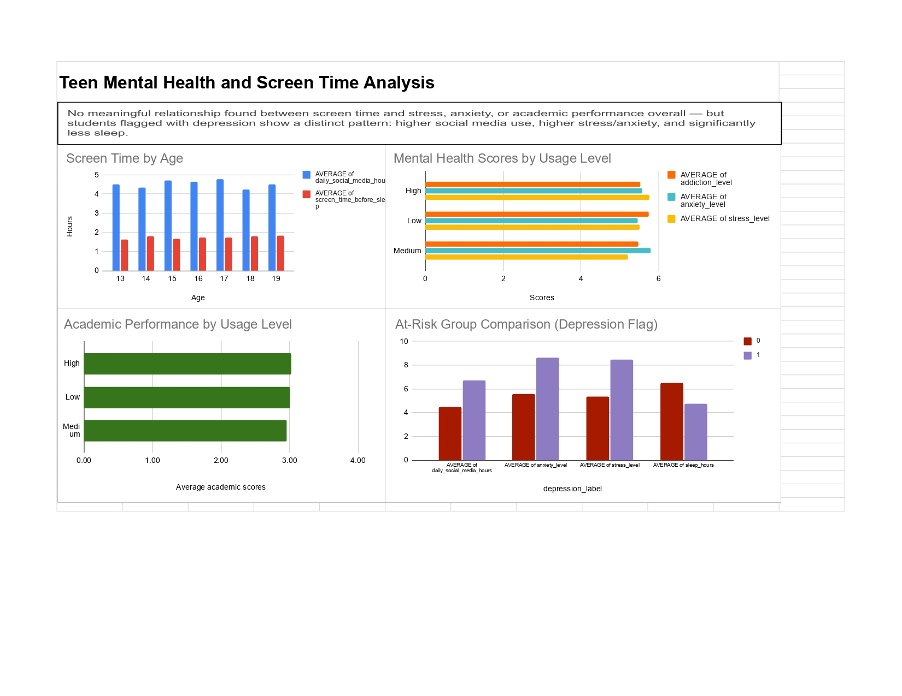

# Teen Mental Health & Screen Time Analysis
Analysed a synthetic teen mental health dataset (1,200 students) using Google Sheets pivot tables to investigate whether social media usage relates to stress, anxiety, sleep, and academic performance — and whether an at-risk subgroup shows a distinct pattern.

**Tools:** Google Sheets (Pivot Tables, Charts)
**Dataset:** [Kaggle Teen Mental Health Dataset](https://www.kaggle.com/datasets/argonnxx/teen-mental-health)
**Live spreadsheet:** [View on Google Sheets](https://docs.google.com/spreadsheets/d/1MQjZCKBhWrs8Q-vcHcOAfEB2aJMkziFzLr7k6yL_l7c/edit?usp=sharing)
**Full workbook:** [Download the Google Sheets file]()

## Business problem
"We've noticed a few students seem to be struggling a lot more than everyone else — way more stressed, more anxious. Can you look into what might be going on with them?"

Questions constructed using 5W1H framework to understand the problem and answer the relevant questions
Q1: Which age group has the highest average screen time (social media hours and screen time before sleep)?
Q2: How does daily social media screen time relate to stress, anxiety, and addiction levels?
Q3: How does daily social media screen time relate to academic performance?
Q4: Is there a meaningful difference between teens flagged with depression vs those without, specifically in social media hours, sleep, stress, and anxiety?

## Q1: Which age group has the highest average screen time (social media hours and screen time before sleep)?

Built a pivot table grouping students by age (13-19 years), with sample sizes ranging from ~150-200 students per age group. Calculated the average daily social media hours and average screen time before sleep for each age.

Finding: Students aged 17 had the highest average daily social media use (4.8 hours). Screen time before sleep was fairly consistent across ages, ages 19 had the highest average screen time before sleep (1.84 hours), closely followed by ages 14 and 18 (1.80 hours each). Other ages ranging as low as 1.6 hours — an overall mild variation (1.62-1.84 hours) across all age groups, suggesting no strong age-driven pattern in pre-sleep screen use.

## Q2: How does daily social media screen time relate to stress, anxiety, and addiction levels?

Grouped student's daily social media hours into three categories — Low (under 3 hours), Medium (3-6 hours), and High (over 6 hours) — each with a healthy sample size (331-533 students). Built a pivot table comparing average stress, anxiety, and addiction levels across these three groups.

Finding: Stress, anxiety, and addiction levels showed minimal variation across Low, Medium, and High social media usage groups, with average scores ranging narrowly between 5.2 and 5.78 regardless of usage level. This suggests no meaningful relationship between overall social media usage and these mental health indicators.

## Q3: How does daily social media screen time relate to academic performance?

Built a pivot table comparing average academic performance scores across the Low/Medium/High social media usage groups.

Finding: Students with Medium daily social media hours (3-6 hours) had the lowest average academic score (2.96), while Low and High groups scored slightly higher (3.01 and 3.02 respectively). The difference between the highest and lowest average scores was only ~2%, suggesting no meaningful relationship between social media usage level and academic performance.

## Q4: Is there a meaningful difference between teens flagged with depression vs those without, specifically in social media hours, sleep, stress, and anxiety?

Built a pivot table comparing students who scored 0 (1,169 participants) vs 1 (31 participants) on the depression scale, looking at average anxiety, stress, social media hours, and sleep hours.

Finding: Students who scored 1 on the depression scale had higher average anxiety (8.6 vs 5.6), stress (8.4 vs 5.4), and social media hours (6.7 vs 4.5), but notably lower average sleep (4.7 vs 6.5 hours) compared to students who scored 0. Despite the smaller sample size for the depression=1 group, the consistent pattern across four independent metrics suggests a meaningful relationship worth further investigation.

Conclusion

Age 17 had the highest average daily social media use (4.8 hours), while age 19 had the highest average screen time before sleep (1.84 hours) — though variation across all age groups was mild.

Across the overall sample, no meaningful relationship was found between daily social media hours and stress, anxiety, addiction, or academic performance. However, students flagged with depression (n=31) showed a distinctly different pattern: notably higher social media use, stress, and anxiety, alongside significantly less sleep, compared to the rest of the sample. This suggests that screen time effects may be concentrated in a small at-risk subgroup rather than affecting all students in this dataset uniformly. A t-test could further validate whether this difference is statistically significant given the small sample size (n=31).

Note: This dataset shows characteristics typical of synthetic/generated data (e.g., minimal variation across most groupings), so findings should be interpreted as exploratory rather than reflective of real-world teen populations.
